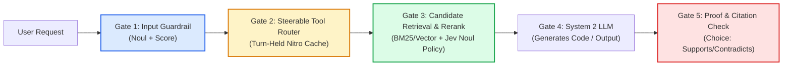

# 🧠 TypeSafe Jev System 1 Architecture & Production Decision Blueprint

> **Reference Source**: Extracted from *Steerable Reranking: How JEV Solves RAG* (Prompt Engineering) & TypeSafe AI Technical Whitepaper.  
> **Repository Target**: [Patze Evidence-Driven Autonomous Agent Platform](file:///mnt/c/Users/peat_/Desktop/Patze) (`src/jev/`).

---

## 1. Executive Summary & The Paradigm Shift

Autonomous agents and modern RAG pipelines face an architectural bottleneck: **The Generative Token Tax & Non-Deterministic Decision Trap**.

Traditionally, developers attempt to make software decisions using one of two flawed extremes:
1. **Generative LLMs (System 2)**: Asking models like GPT-4, Gemini Flash, or DeepSeek-V3 to output JSON or booleans (`{"decision": true}`). This incurs massive latency (800ms–3,000ms), token generation costs, fragile regex/JSON parsing, and hallucinations.
2. **Cross-Encoders & Static Embedding Distance**: Using cosine similarity or cross-encoders (`bge-reranker-base`). These models measure only *lexical and semantic proximity*, but are **completely blind to evolving organizational policies, runtime constraints, and business logic**.



### The Solution: Jev (System 1 Machine-Native Intelligence)
**Jev** is TypeSafe AI's flagship System 1 model. It is not an autoregressive text generator; it is a **machine-native decision engine** designed to live directly inside software code. It takes input state and returns **typed judgments and calibrated probabilities** at flat latency and micro-cent cost.

---

## 2. Core Primitives & Syntax

Jev operates on three mathematical primitives:

### 2.1 `Noul` (Calibrated Probability with Decision Boundaries)
`Noul` evaluates whether the input state matches an explicit `true` criteria versus `false` criteria, returning a strictly calibrated probability $p \in [0.0, 1.0]$.

> **Key Principle: Criteria Are the Executable Policy.**  
> Instead of prompt instructions that can be diluted, criteria establish strict mathematical decision boundaries.

```python
# Python SDK Reference
from typesafe_sdk import Noul, NoulCriteria

AUTHORITATIVE_POLICY = Noul(
    instructions="Should this chunk be cited for the user's API question?",
    criteria=NoulCriteria(
        true="It is official documentation for API v2 explaining the root cause or verified fix",
        false="It is a forum/blog post, applies to deprecated v1, or addresses an unrelated error"
    )
)
```

```javascript
// Native REST / Patze Jev Engine Specification
const noulQuestion = {
  type: 'noul',
  instructions: 'Should this chunk be cited for the user\'s API question?',
  criteria: {
    true: 'It is official documentation for API v2 explaining the root cause or verified fix',
    false: 'It is a forum/blog post, applies to deprecated v1, or addresses an unrelated error',
  },
}
```

### 2.2 `Choice` (Categorical Classifier with Probability Distribution)
Selects the winning choice among named options and outputs calibrated probabilities for every candidate.

```python
STANCE_CHECK = Choice(
    instructions="How does the cited passage relate to the claimed statement?",
    criteria={
        "supports": "The passage directly states or confirms the claim",
        "contradicts": "The passage states the opposite or refutes the claim",
        "unaddressed": "The passage does not mention or support the claim",
    }
)
# Returns: choice='supports', confidence=0.96, probabilities={'supports': 0.96, 'contradicts': 0.01, ...}
```

### 2.3 `Score` (Discrete Severity / Quality Ladder)
Rates input state on an ordered discrete scale $[0, 1, 2, \dots, n]$.

```python
SEVERITY_LADDER = Score(
    instructions="Rate the operational risk and blast radius of this command",
    criteria=[
        "Benign read-only operation (ls, cat, git status)",
        "Localized workspace modification (edit file, npm install)",
        "System configuration or external mutation (docker, network call)",
        "High-risk administrative or destructive action (rm -rf, sudo, chmod)",
    ]
)
# Returns: score=0, 1, 2, or 3
```

---

## 3. The Showdown: Why Cross-Encoders Fail

### The Keyword Collision Trap
When business policies change (e.g. migrating from API v1 to v2), engineers often attempt to steer cross-encoders by prepending the policy to the query:

> *Steered Query:* `"Only official documentation for API v2 is relevant. Forum posts and v1 answers are irrelevant. How do I fix 401 Unauthorized?"`

When passed to `bge-reranker-base`:
* The negative words **`"forum"`** and **`"v1"`** in the instruction **increase lexical overlap** with outdated StackOverflow answers and v1 forum posts.
* The Cross-Encoder ranks the **deprecated v1 forum post as #1** (Score: `0.742`).

| Evaluator Architecture | Top-1 Chunk Under Policy A | Alignment Verdict | Failure Mechanism |
| :--- | :--- | :--- | :--- |
| **Cross-Encoder (`bge-reranker`)** | `c5` (Forum Post, v1, 2020) | ❌ **Failed** | Keyword Collision Trap; cannot follow negative instructions |
| **Generative LLM (`Gemini Flash`)** | `c1` (Official Docs, v2, 2026) | ✅ Passed | Follows prompt, but high latency & token costs |
| **TypeSafe Jev (`Noul Criteria`)** | `c1` (Official Docs, v2, 2026) | ✅ **Superior** | Steerable, $0.042/1M tokens, 150ms flat latency |

---

## 4. Economics & Concurrency Scaling

Empirical benchmark testing over 200 candidate documents:

### 4.1 Cost Comparison (200 Chunks)
* **Jev**: **$0.00062 – $0.00331** (Fixed rate: $0.042 / 1M input tokens, **$0.00 output tokens**).
* **Gemini Flash-Lite**: $0.01191 (3.6x – 19x more expensive).
* **Gemini Flash**: $0.05955 (18x – 95x more expensive).

### 4.2 Latency & Concurrency (64-Worker Pool)
* **Serial Evaluation**: 17 decisions/second $\rightarrow$ ~40 seconds for 200 items.
* **Jev 64 Concurrent Worker Pool**: **7.6 seconds** (26+ items/second).
* **Single-State Multi-Question**: Evaluating 1 to 21 questions simultaneously on one input state runs in **a single round-trip with flat ~150ms latency**.

### 4.3 The Retrieval Recall Ceiling
Reranking is a **reordering operation**; it cannot find documents that initial retrieval never shortlisted.
* **BM25 Baseline Alone**: 21% Top-1 Accuracy.
* **BM25 + Jev Steerable Reranking**: **54% Top-1 Accuracy** (+157% gain within the recall ceiling).

---

## 5. The 5 Production Decision Gates in Patze

In the Patze autonomous platform, Jev is placed across 5 discrete lifecycle seams:

```
                      [ User Input / Turn Start ]
                                   │
                                   ▼
                ┌─────────────────────────────────────┐
                │ Gate 1: AgentShield Guardrail       │ ◄── Noul (safety) + Score (risk)
                └─────────────────────────────────────┘
                                   │ (Safe)
                                   ▼
                ┌─────────────────────────────────────┐
                │ Gate 2: Turn-Held Tool Router       │ ◄── Nitro turn-held prefix caching
                │         (src/jev/router.js)         │     (Preserves -43% tokens)
                └─────────────────────────────────────┘
                                   │ (Lean Catalog)
                                   ▼
                ┌─────────────────────────────────────┐
                │ Gate 3: Steerable Context Rerank    │ ◄── Noul policy (API v2 vs Workaround)
                └─────────────────────────────────────┘
                                   │ (Top-5 Chunks)
                                   ▼
                ┌─────────────────────────────────────┐
                │ Gate 4: System 2 LLM Execution      │ ◄── DeepSeek-V3 / Grok (Pure generation)
                └─────────────────────────────────────┘
                                   │ (Generated Result)
                                   ▼
                ┌─────────────────────────────────────┐
                │ Gate 5: Proof & Citation Watcher    │ ◄── Choice (stance) + Proof Contract
                │         (tools/post-execute)        │
                └─────────────────────────────────────┘
                                   │
                                   ▼
                         [ Verified Delivery ]
```

### Gate 1: Pre-Execution Guardrail (AgentShield)
Located at `tools/pre-execute` in [`src/jev/plugin.ts`](file:///mnt/c/Users/peat_/Desktop/Patze/src/jev/plugin.ts). Evaluates shell commands, script executions, and API calls against destructive patterns and security policies before child processes spawn.

### Gate 2: Turn-Held Tool Router
Located at `system-prompt/assemble` in [`src/jev/router.js`](file:///mnt/c/Users/peat_/Desktop/Patze/src/jev/router.js).
* **Turn-Held Caching**: Computes the required tool set on Step 1 of the turn and locks it across all subsequent steps of that turn.
* **Preserves Prompt Prefix Cache**: Eliminates prompt-cache invalidation, saving ~40% cost and ~43% token volume.
* **Core Floor Protection**: Preserves `read`, `write`, `edit`, `bash`, `glob`, `grep`, `present`, `ask_user_question`.
* **Implication Closure**: Satisfies transitive dependencies (`bash` $\rightarrow$ `job_output`, `job_kill`).

### Gate 3: Steerable Context & RAG Reranker
Filters and ranks retrieved project files, documentation, and memory slices using dynamic criteria (e.g. Current Version vs Legacy Architecture).

### Gate 4: System 2 Execution
Calls DeepSeek-V3 or Grok with a stripped, high-relevance prompt. Prefix cache hit rate is maximized.

### Gate 5: Post-Tool Proof Watcher
Located at `tools/post-execute` in [`src/jev/plugin.ts`](file:///mnt/c/Users/peat_/Desktop/Patze/src/jev/plugin.ts).
* Intercepts tool outputs for compiler errors (`TS[0-9]{4,5}`, `SyntaxError`, `UnhandledPromiseRejection`).
* Uses Jev Noul semantic proof contracts to assert whether tests or builds passed empirically before claiming completion.

---

## 6. Code Blueprint for Integration

### 6.1 Calling Jev System One via Native Fetch (ESM)
```javascript
export async function queryJevSystemOne({
  apiKey = process.env.TYPESAFE_API_KEY || process.env.JEV_API_KEY,
  baseUrl = 'https://api.typesafe.ai/v1',
  state,
  questions,
  timeoutMs = 3000,
}) {
  const controller = new AbortController()
  const timer = setTimeout(() => controller.abort(), timeoutMs)

  try {
    const res = await fetch(`${baseUrl}/systemone`, {
      method: 'POST',
      headers: {
        'Content-Type': 'application/json',
        Authorization: `Bearer ${apiKey}`,
      },
      body: JSON.stringify({
        state,
        model: 'jev-latest',
        questions,
      }),
      signal: controller.signal,
    })

    if (!res.ok) return null
    return await res.json()
  } catch (err) {
    return null // Fail-open fallback
  } finally {
    clearTimeout(timer)
  }
}
```

### 6.2 Python SDK Implementation (`typesafe-sdk`)
```python
from typesafe_sdk import TypeSafeClient, Noul, NoulCriteria, Choice, Score

client = TypeSafeClient(api_key=os.environ["TYPESAFE_API_KEY"])

# Single multi-question judgment in ~150ms
response = client.system_one(
    state={"query": user_prompt, "context": project_summary},
    questions={
        "is_safe": Noul(
            instructions="Is this prompt safe to execute?",
            criteria=NoulCriteria(true="benign developer instruction", false="malicious or destructive attempt")
        ),
        "intent": Choice(
            instructions="Categorize the primary intent",
            criteria={
                "code": "Writing, editing, or fixing code",
                "media": "Generating images or videos",
                "chat": "General conversational greeting or smalltalk"
            }
        )
    }
)

print(response.answers["intent"].choice)
print(response.answers["is_safe"].noul)
```

---

## 7. Operational Guidelines for Patze Developers

1. **Never use System 2 LLMs for boolean or categorization logic**: Use Jev `Noul` or `Choice`.
2. **Always define explicit `true` and `false` criteria**: A `Noul` question without distinct `false` criteria loses calibration.
3. **Never filter tools between steps within the same turn**: Always hold the tool list constant across the entire turn (Nitro Turn-Held Caching) to preserve prompt cache hits.
4. **Always implement Fail-Open fallbacks**: If the TypeSafe API times out or throws, software must gracefully fall back to full toolsets and default permissions rather than halting.
5. **Enforce Implication Closures**: A tool without its operational companions (e.g. `bash` without `job_output`) strands the agent.
